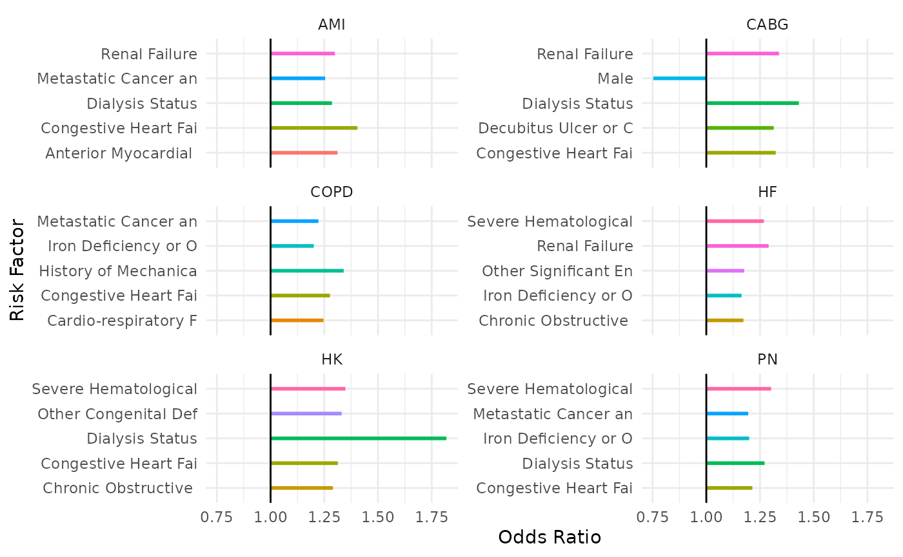

# Investigating a Hospital-Specific Report (HSR)

***Note**: CMS changed the format of Hospital-Specific Reports (HSRs)
for FY2026 (see
[here](https://qualitynet.cms.gov/inpatient/hrrp/reports#tab2)). The
current HSR functions support Excel-based formats through FY2025.
However, analysis strategies are still relevant.*

As part of the [Hospital Readmissions Reduction Program
(HRRP)](https://www.cms.gov/medicare/payment/prospective-payment-systems/acute-inpatient-pps/hospital-readmissions-reduction-program-hrrp),
the [Centers for Medicare & Medicaid Services
(CMS)](https://www.cms.gov/) provides a detailed, annual program summary
report (called the [Hospital-Specific Report
(HSR)](https://qualitynet.cms.gov/inpatient/hrrp/reports)) to hospitals
that includes details on the penalty calculation for the upcoming fiscal
year, such as discharge-level data, dually-eligible discharge lists,
cohort-level rollup, and the penalty amount. There is a defined [review
and correction
period](https://qualitynet.cms.gov/inpatient/hrrp/resources#tab1:~:text=FY%202026%20Hospital%20Readmissions%20Reduction%20Program%20Key%20Dates%20(08/11/25))
in which hospitals can use these reports to ensure the penalty being
enforced by CMS is accurate. It occurs approximately 1 month before the
new fiscal year, thus it is a time-critical event (see historical date
ranges below for reference with the built-in package datasets):

``` r
# Extract date ranges
readmit::hrrp_keydates |>
  dplyr::select(
    ProgramYear,
    dplyr::matches("^(Payment|Review)")
  ) |>
  dplyr::distinct()
#> # A tibble: 9 × 5
#>   ProgramYear PaymentStartDate PaymentEndDate ReviewStartDate ReviewEndDate
#>         <dbl> <date>           <date>         <chr>           <chr>        
#> 1        2027 2026-10-01       2027-09-30     NA              NA           
#> 2        2026 2025-10-01       2026-09-30     2025-08-12      2025-09-10   
#> 3        2025 2024-10-01       2025-09-30     2024-08-12      2024-09-10   
#> 4        2024 2023-10-01       2024-09-30     2023-08-08      2023-09-07   
#> 5        2023 2022-10-01       2023-09-30     2022-08-08      2022-09-07   
#> 6        2022 2021-10-01       2022-09-30     2021-08-09      2021-09-08   
#> 7        2021 2020-10-01       2021-09-30     2020-08-10      2020-09-09   
#> 8        2020 2019-10-01       2020-09-30     2019-08-09      2019-09-09   
#> 9        2019 2018-10-01       2019-09-30     2018-08-06      2018-09-05
```

The report file itself (through FY2025) is a large, multi-tab Microsoft
Excel document where the structured part of the data is ambiguously
placed throughout, thus we need tools to parse it out into a usable
format. That is what some functions in the `readmit` package are for. In
this article, we go through the tools that are available, what they do,
and then provide some strategies/approaches for how hospitals can use
these tools to analyze their own HSR’s to gain deeper insight into HRRP
results and readmissions more broadly.

## The Toolbox

First, we’ll start by taking a look at what relevant functions are
available to us, what they do, and how to use them. For our purposes,
these are all of the functions prefixed like `hsr_*`. We’ll do this
roughly in order of how the report is laid out, and how the HRRP results
roll up.

``` r
library(readmit)
```

### 0. Mock Reports

As the developer of this package, I don’t have access to hospitals’
actual HSR’s, as they contain senstivie patient information (i.e.,
[PHI](https://cphs.berkeley.edu/hipaa/hipaa18.html)) and thus are not
publicly available. So what we have to work with are *mock* reports that
[CMS provides](https://qualitynet.cms.gov/inpatient/hrrp/reports#tab3)
to the public that are meant to mimick the format a hospital can expect
their report to be in. It just includes fake data.

***Note**: CMS changed the format of Hospital-Specific Reports (HSRs)
for FY2026 (see
[here](https://qualitynet.cms.gov/inpatient/hrrp/reports#tab2)). The
current HSR functions support Excel-based formats through FY2025.*

Nevertheless, these provide a useful playground to analyze the mechanics
of the program. We’ll start by finding a report with the
[`hsr_mock_reports()`](https://centralstatz.github.io/readmit/reference/hsr_mock_reports.md)
function:

- Using no arguments lists the various mock files included in the
  package

``` r
hsr_mock_reports()
#> [1] "FY2019_HRRP_MockHSR.xlsx" "FY2020_HRRP_MockHSR.xlsx"
#> [3] "FY2021_HRRP_MockHSR.xlsx" "FY2022_HRRP_MockHSR.xlsx"
#> [5] "FY2023_HRRP_MockHSR.xlsx" "FY2024_HRRP_MockHSR.xlsx"
#> [7] "FY2025_HRRP_MockHSR.xlsx"
```

- Entering one of the listed file names will return the complete path to
  the file in the packages location on your computer

``` r
my_report <- hsr_mock_reports("FY2025_HRRP_MockHSR.xlsx")
my_report
#> [1] "/home/runner/work/_temp/Library/readmit/extdata/FY2025_HRRP_MockHSR.xlsx"
```

Now we can use that HSR path with other package functions. Of course,
you would just point to your own HSR when analyzing your hospital’s
reports.

### 1. Program Summary

We’ll start with high level program results. Ultimately, all of the
moving parts in the HRRP roll up into a single number: the penalty
amount applied to your hospital. This is typically the first table in
your report. We can parse it out of the report with the
[`hsr_payment_summary()`](https://centralstatz.github.io/readmit/reference/hsr_payment_summary.md)
function:

``` r
my_payment_summary <- hsr_payment_summary(my_report)
my_payment_summary
#> # A tibble: 1 × 7
#>   Number of Dually Eligible Stays…¹ Total Number of Stay…² `Dual Proportion [c]`
#>                               <dbl>                  <dbl>                 <dbl>
#> 1                               186                    856                 0.217
#> # ℹ abbreviated names: ¹​`Number of Dually Eligible Stays (Numerator) [a]`,
#> #   ²​`Total Number of Stays(Denominator) [b]`
#> # ℹ 4 more variables: `Peer Group Assignment [d]` <dbl>,
#> #   `Neutrality Modifier [e]` <dbl>, `Payment Reduction Percentage [f]` <dbl>,
#> #   `Payment Adjustment Factor [g]` <dbl>
```

We now have this information in a data frame that we can manipulate as
needed:

``` r
my_payment_summary |>
  tidyr::pivot_longer(dplyr::everything())
#> # A tibble: 7 × 2
#>   name                                               value
#>   <chr>                                              <dbl>
#> 1 Number of Dually Eligible Stays (Numerator) [a] 186     
#> 2 Total Number of Stays(Denominator) [b]          856     
#> 3 Dual Proportion [c]                               0.217 
#> 4 Peer Group Assignment [d]                         3     
#> 5 Neutrality Modifier [e]                           0.965 
#> 6 Payment Reduction Percentage [f]                  0.0007
#> 7 Payment Adjustment Factor [g]                     0.999
```

There are also helper functions to extract specific components from this
table.

``` r
hsr_payment_penalty(my_report)
#> [1] 7e-04
hsr_dual_proportion(my_report)
#> [1] 0.2172897
hsr_peer_group(my_report)
#> [1] 3
```

See
[`?hsr_payment_summary`](https://centralstatz.github.io/readmit/reference/hsr_payment_summary.md)
for all of them.

### 2. Cohort Summary

The overall payment penalty a hospital receives is a weighted average of
penalities applied to the individual cohorts. These details are
typically in the second table (tab) of the HSR, which we can import with
[`hsr_cohort_summary()`](https://centralstatz.github.io/readmit/reference/hsr_cohort_summary.md):

``` r
cohort_summary <- hsr_cohort_summary(my_report)
cohort_summary
#> # A tibble: 6 × 10
#>   `Measure [a]` `Number of Eligible Discharges [b]` Number of Readmissions Amo…¹
#>   <chr>                                       <dbl>                        <dbl>
#> 1 AMI                                             2                            0
#> 2 COPD                                           18                            3
#> 3 HF                                             25                            2
#> 4 Pneumonia                                      32                            5
#> 5 CABG                                           NA                           NA
#> 6 THA/TKA                                        45                            0
#> # ℹ abbreviated name: ¹​`Number of Readmissions Among Eligible Discharges [c]`
#> # ℹ 7 more variables: `Predicted Readmission Rate [d]` <dbl>,
#> #   `Expected Readmission Rate [e]` <dbl>,
#> #   `Excess Readmission Ratio (ERR) [f]` <dbl>,
#> #   `Peer Group Median ERR [g]` <dbl>, `Penalty Indicator (Yes/No) [h]` <chr>,
#> #   `Ratio of DRG Payments Per Measure to Total Payments [i]` <dbl>,
#> #   `National Observed Readmission Rate [j]` <dbl>
```

We can then, for example, reconcile the overall penalty amount based on
what is in this table:

``` r
cohort_summary |>

  # Filter to cohorts with a penalty
  dplyr::filter(`Penalty Indicator (Yes/No) [h]` == "Yes") |>
  
  # Compute the contribution of each penalized cohort
  dplyr::mutate(
    Contribution = 
      `Ratio of DRG Payments Per Measure to Total Payments [i]` *
      (
        `Excess Readmission Ratio (ERR) [f]` - 
          `Peer Group Median ERR [g]`
      )
  ) |>
  
  # Roll up into final calculation
  dplyr::summarize(
    Penalty = sum(Contribution) * hsr_neutrality_modifier(my_report)
  )
#> # A tibble: 1 × 1
#>    Penalty
#>      <dbl>
#> 1 0.000746
```

What we did here was:

1.  Find cohorts who received a penalty *who were eligible*
    - A cohort must have at least 25 discharges to be eligible
    - Then, the excess readmission ratio (ERR) must be greater than the
      assigned peer group’s median ERR
2.  Find the difference between the hospital’s ERR compared to the peer
    group median ERR
3.  Multiply that by the ratio of DRG payments for that cohort
    - This is a measure of the volume of patients with this condition
      are treated at the hospital
4.  Sum those contributions over each cohort
5.  Multiply that by the neutrality modifier in the
    [`hsr_payment_summary()`](https://centralstatz.github.io/readmit/reference/hsr_payment_summary.md)
    table

That’s how the penalty is computed, from cohort summary level.

### 3. Discharges

*Note: Because we are using mock reports, the dates in these files are
erroneous and thus R doesn’t interpret them as dates. However, your
hospital report has real dates and thus R should automatically parse
them as such.*

The HSR also contains discharge-level data on the individual patients
that actually contributed to the program. There is a separate table/tab
for each of the cohorts. We can use the
[`hsr_discharges()`](https://centralstatz.github.io/readmit/reference/hsr_discharges.md)
function to import them for a specified cohort:

``` r
hsr_discharges(my_report, "COPD")
#> # A tibble: 21 × 17
#>    `ID Number` MBI         `Medical Record Number` `Beneficiary DOB`
#>          <int> <chr>       <chr>                   <chr>            
#>  1           1 9AA9AA9AA99 99999A                  99/99/9999       
#>  2           2 9AA9AA9AA99 99999A                  99/99/9999       
#>  3           3 9AA9AA9AA99 99999A                  99/99/9999       
#>  4           4 9AA9AA9AA99 99999A                  99/99/9999       
#>  5           5 9AA9AA9AA99 99999A                  99/99/9999       
#>  6           6 9AA9AA9AA99 99999A                  99/99/9999       
#>  7           7 9AA9AA9AA99 99999A                  99/99/9999       
#>  8           8 9AA9AA9AA99 99999A                  99/99/9999       
#>  9           9 9AA9AA9AA99 99999A                  99/99/9999       
#> 10          10 9AA9AA9AA99 99999A                  99/99/9999       
#> # ℹ 11 more rows
#> # ℹ 13 more variables: `Admission Date of Index Stay` <chr>,
#> #   `Discharge Date of Index Stay` <chr>,
#> #   `Cohort Inclusion/Exclusion Indicator` <chr>, `Index Stay (Yes/No)` <chr>,
#> #   `Principal Discharge Diagnosis of Index Stay` <chr>,
#> #   `Discharge Destination` <chr>,
#> #   `Unplanned Readmission within 30 Days (Yes/No) [a]` <chr>, …
```

We get some patient identifying information, including the specific
dates associated with the index and readmission hospitalizations,
whether or not the readmission occurred at the same hospital, diagnosis
codes, etc., which is all very valuable information that we can explore
to gain insights from (and what we’ll do [later](#analysisstrategies)).

There are also options available in the function to refine the result:

#### Eligible Cases

The `eligible_only` argument can be used to only included discharges
that were actually included in HRRP evaluation:

``` r
hsr_discharges(
  file = my_report, 
  cohort = "COPD",
  eligible_only = TRUE
)
#> # A tibble: 18 × 17
#>    `ID Number` MBI         `Medical Record Number` `Beneficiary DOB`
#>          <int> <chr>       <chr>                   <chr>            
#>  1           1 9AA9AA9AA99 99999A                  99/99/9999       
#>  2           2 9AA9AA9AA99 99999A                  99/99/9999       
#>  3           3 9AA9AA9AA99 99999A                  99/99/9999       
#>  4           4 9AA9AA9AA99 99999A                  99/99/9999       
#>  5           5 9AA9AA9AA99 99999A                  99/99/9999       
#>  6           6 9AA9AA9AA99 99999A                  99/99/9999       
#>  7           7 9AA9AA9AA99 99999A                  99/99/9999       
#>  8           8 9AA9AA9AA99 99999A                  99/99/9999       
#>  9           9 9AA9AA9AA99 99999A                  99/99/9999       
#> 10          10 9AA9AA9AA99 99999A                  99/99/9999       
#> 11          11 9AA9AA9AA99 99999A                  99/99/9999       
#> 12          12 9AA9AA9AA99 99999A                  99/99/9999       
#> 13          13 9AA9AA9AA99 99999A                  99/99/9999       
#> 14          14 9AA9AA9AA99 99999A                  99/99/9999       
#> 15          15 9AA9AA9AA99 99999A                  99/99/9999       
#> 16          16 9AA9AA9AA99 99999A                  99/99/9999       
#> 17          17 9AA9AA9AA99 99999A                  99/99/9999       
#> 18          18 9AA9AA9AA99 99999A                  99/99/9999       
#> # ℹ 13 more variables: `Admission Date of Index Stay` <chr>,
#> #   `Discharge Date of Index Stay` <chr>,
#> #   `Cohort Inclusion/Exclusion Indicator` <chr>, `Index Stay (Yes/No)` <chr>,
#> #   `Principal Discharge Diagnosis of Index Stay` <chr>,
#> #   `Discharge Destination` <chr>,
#> #   `Unplanned Readmission within 30 Days (Yes/No) [a]` <chr>,
#> #   `Planned Readmission within 30 Days (Yes/No)` <chr>, …
```

Notice that this row count matches what was reported as the COPD
denominator in the `cohort_summary`:

``` r
cohort_summary |>
  dplyr::filter(`Measure [a]` == "COPD") |>
  dplyr::pull(`Number of Eligible Discharges [b]`)
#> [1] 18
```

#### Risk Factors

Also included in these tables are the indicators of risk factors that
are used in the statistical models to estimate individual adjusted
readmission risks. We can use the `risk_factors` argument to extract
those for each patient:

``` r
hsr_discharges(
  file = my_report, 
  cohort = "COPD",
  eligible_only = TRUE,
  risk_factors = TRUE,
  discharge_phi = FALSE
)
#> # A tibble: 18 × 42
#>    `ID Number` `Years Over 65 (continuous)` `History of Mechanical Ventilation`
#>          <int>                        <dbl>                               <dbl>
#>  1           1                            5                                   1
#>  2           2                            8                                   1
#>  3           3                           23                                   0
#>  4           4                           15                                   0
#>  5           5                            7                                   0
#>  6           6                            1                                   0
#>  7           7                           12                                   0
#>  8           8                           18                                   0
#>  9           9                            6                                   0
#> 10          10                           11                                   0
#> 11          11                           15                                   0
#> 12          12                           13                                   0
#> 13          13                            5                                   0
#> 14          14                           12                                   0
#> 15          15                           12                                   0
#> 16          16                           24                                   0
#> 17          17                           12                                   0
#> 18          18                           11                                   0
#> # ℹ 39 more variables: `Sleep-Disordered Breathing` <dbl>,
#> #   `History of COVID-19` <dbl>,
#> #   `Severe Infection; Other Infectious Diseases` <dbl>,
#> #   `Metastatic Cancer and Acute Leukemia` <dbl>,
#> #   `Lung and Other Severe Cancers` <dbl>,
#> #   `Lymphatic, Head and Neck, Brain, and Other Major Cancers; Breast, Colorectal and Other Cancers and Tumors; Other Respiratory and Heart Neoplasms` <dbl>,
#> #   `Other Digestive and Urinary Neoplasms` <dbl>, …
```

This data can then be explored further to understand risk factor
prevalence and how that relates to model weights, etc. (again, covered
[later](#analysisstrategies)). Notice the `discharge_phi` argument was
used to prevent the date information from being returned.

### 4. Model Coefficients

The ERR is calculated based on an aggregated roll up of individual
adjusted readmission risks derived from a random-intercept logistic
regression model. The first row in the discharge table contains the
coefficients for this model. We can use the
[`hsr_coefficients()`](https://centralstatz.github.io/readmit/reference/hsr_coefficients.md)
function to extract them:

``` r
copd_model <- hsr_coefficients(my_report, "COPD")
copd_model
#> # A tibble: 43 × 2
#>    Factor                                                                  Value
#>    <chr>                                                                   <dbl>
#>  1 Years Over 65 (continuous)                                           -0.00550
#>  2 History of Mechanical Ventilation                                     0.293  
#>  3 Sleep-Disordered Breathing                                           -0.0339 
#>  4 History of COVID-19                                                  -0.0200 
#>  5 Severe Infection; Other Infectious Diseases                           0.0381 
#>  6 Metastatic Cancer and Acute Leukemia                                  0.201  
#>  7 Lung and Other Severe Cancers                                         0.156  
#>  8 Lymphatic, Head and Neck, Brain, and Other Major Cancers; Breast, C… -0.00343
#>  9 Other Digestive and Urinary Neoplasms                                -0.0792 
#> 10 Diabetes Mellitus (DM) or DM Complications                            0.0891 
#> # ℹ 33 more rows
```

This allows us to do things like assess the relative contribution of
risk factors to the estimated readmission rates or use the risk factor
dataset above to compute individual level readmission risks.

#### Intercept Terms

The *predicted* and *expected* readmission rates only differ in the
intercept terms applied to the prediction (thus it is a constant shift
for all patients). We can see these at the end of this data frame:

``` r
copd_model |> tail()
#> # A tibble: 6 × 2
#>   Factor                                           Value
#>   <chr>                                            <dbl>
#> 1 Renal Failure                                   0.160 
#> 2 Decubitus Ulcer or Chronic Skin Ulcer           0.0729
#> 3 Cellulitis, Local Skin Infection                0.0412
#> 4 Vertebral Fractures Without Spinal Cord Injury  0.0822
#> 5 HOSP_EFFECT                                    -2.53  
#> 6 AVG_EFFECT                                     -2.53
```

### 5. Readmission Risks

We could take the risk factor output from
[`hsr_discharges()`](https://centralstatz.github.io/readmit/reference/hsr_discharges.md)
combined with the coefficients from
[`hsr_coefficients()`](https://centralstatz.github.io/readmit/reference/hsr_coefficients.md)
and reconcile each patient’s *predicted* and *expected* readmission
risk. But the
[`hsr_readmission_risks()`](https://centralstatz.github.io/readmit/reference/hsr_readmission_risks.md)
function can do all of that for us:

``` r
risks <- hsr_readmission_risks(my_report, "COPD")
risks
#> # A tibble: 18 × 3
#>    `ID Number` Predicted Expected
#>          <int>     <dbl>    <dbl>
#>  1           1    0.260    0.260 
#>  2           2    0.266    0.266 
#>  3           3    0.227    0.227 
#>  4           4    0.0990   0.0989
#>  5           5    0.0935   0.0935
#>  6           6    0.130    0.130 
#>  7           7    0.156    0.156 
#>  8           8    0.190    0.190 
#>  9           9    0.0842   0.0842
#> 10          10    0.100    0.100 
#> 11          11    0.129    0.129 
#> 12          12    0.111    0.111 
#> 13          13    0.350    0.349 
#> 14          14    0.127    0.127 
#> 15          15    0.158    0.158 
#> 16          16    0.168    0.168 
#> 17          17    0.118    0.118 
#> 18          18    0.210    0.210
```

This just takes a weighted-sum of the risk factors and coefficients,
adds the corresponding intercept, and then maps it to a probability
through the logistic function.

The cohort-level *predicted* and *expected* readmission rates are just
the averages of these columns across all eligible patients:

``` r
risks |>
  dplyr::summarize(
    Discharges = dplyr::n(),
    Predicted = mean(Predicted),
    Expected = mean(Expected),
    ERR = Predicted / Expected
  )
#> # A tibble: 1 × 4
#>   Discharges Predicted Expected   ERR
#>        <int>     <dbl>    <dbl> <dbl>
#> 1         18     0.165    0.165  1.00
```

Again, looking at our cohort summary, we can see these match:

``` r
cohort_summary |> 
  dplyr::filter(
    `Measure [a]` == "COPD"
  ) |>
  dplyr::select(
    Discharges = `Number of Eligible Discharges [b]`,
    Predicted = `Predicted Readmission Rate [d]`,
    Expected = `Expected Readmission Rate [e]`,
    ERR = `Excess Readmission Ratio (ERR) [f]`
  )
#> # A tibble: 1 × 4
#>   Discharges Predicted Expected   ERR
#>        <dbl>     <dbl>    <dbl> <dbl>
#> 1         18     0.165    0.165  1.00
```

### 6. Dual Stays

CMS puts hospitals into peer groups based on the relative proportion of
Medicare patients who are also eligible for Medicaid. This is a measure
of socioeconomic status for the hospital population so hospitals are
being compared only against other hospitals that are similar (in this
regard). These aggregated quantities were found in
[`hsr_payment_summary()`](https://centralstatz.github.io/readmit/reference/hsr_payment_summary.md)
result:

``` r
my_payment_summary
#> # A tibble: 1 × 7
#>   Number of Dually Eligible Stays…¹ Total Number of Stay…² `Dual Proportion [c]`
#>                               <dbl>                  <dbl>                 <dbl>
#> 1                               186                    856                 0.217
#> # ℹ abbreviated names: ¹​`Number of Dually Eligible Stays (Numerator) [a]`,
#> #   ²​`Total Number of Stays(Denominator) [b]`
#> # ℹ 4 more variables: `Peer Group Assignment [d]` <dbl>,
#> #   `Neutrality Modifier [e]` <dbl>, `Payment Reduction Percentage [f]` <dbl>,
#> #   `Payment Adjustment Factor [g]` <dbl>
```

The
[`hsr_dual_stays()`](https://centralstatz.github.io/readmit/reference/hsr_dual_stays.md)
function extracts the discharge-level data corresponding to the
numerator of the ratio:

``` r
hsr_dual_stays(my_report)
#> # A tibble: 186 × 6
#>    `ID Number` MBI         `Beneficiary DOB` `Admission Date` `Discharge Date`
#>          <int> <chr>       <chr>             <chr>            <chr>           
#>  1           1 9AA9AA9AA99 99/99/9999        99/99/9999       99/99/9999      
#>  2           2 9AA9AA9AA99 99/99/9999        99/99/9999       99/99/9999      
#>  3           3 9AA9AA9AA99 99/99/9999        99/99/9999       99/99/9999      
#>  4           4 9AA9AA9AA99 99/99/9999        99/99/9999       99/99/9999      
#>  5           5 9AA9AA9AA99 99/99/9999        99/99/9999       99/99/9999      
#>  6           6 9AA9AA9AA99 99/99/9999        99/99/9999       99/99/9999      
#>  7           7 9AA9AA9AA99 99/99/9999        99/99/9999       99/99/9999      
#>  8           8 9AA9AA9AA99 99/99/9999        99/99/9999       99/99/9999      
#>  9           9 9AA9AA9AA99 99/99/9999        99/99/9999       99/99/9999      
#> 10          10 9AA9AA9AA99 99/99/9999        99/99/9999       99/99/9999      
#> # ℹ 176 more rows
#> # ℹ 1 more variable: `Claim Type` <chr>
```

We can see that the row count of this discharge level data matches the
first number in the preceding table.

## Analysis Strategies

In this section we’ll go through a collection data analyses that can be
conducted, using functions in `readmit` as support, to validate HSR
calculations and/or to gain deeper insights into HRRP results.

### 1. Validating the Penalty Calculation

We [previously calculated](#cohortsummary) the payment penalty starting
from the cohort-level results. However, as an initial validation step,
it is important to go through the mechanics of reconciling the penalty
calculation from the discharge-level data to ensure comprehension of how
it works.

*Note: We’ll go the slower, more tedious way to do this in the steps
below in order to capture all intermediate details for understanding,
but will callout where certain steps can be more efficient.*

Let’s extract the `cohort` strings we need to plug into various function
arguments:

``` r
cohorts <- setdiff(names(hrrp_cohort_inclusion), "ProgramYear")
cohorts
#> [1] "AMI"  "COPD" "HF"   "PN"   "CABG" "HK"
```

#### i. Extract Discharges

The first thing we need to is extract the set of discharges (i.e., the
*denominator*) that contribute to program for each cohort. To do this,
we’ll iterate through the different cohorts and sequentially use the
[`hsr_discharges()`](https://centralstatz.github.io/readmit/reference/hsr_discharges.md)
function to get the row identifiers that should be included:

``` r
eligible_discharges <-
  setdiff(cohorts, "CABG") |>

    # Iterate each cohort
    purrr::map_df(

      # Import eligible discharges
      ~hsr_discharges(
        file = my_report,
        cohort = .x,
        eligible_only = TRUE
      ) |>

      # Keep the row identifiers
      dplyr::select(`ID Number`) |>

      # Add cohort identifier
      tibble::add_column(Cohort = .x)
    )
eligible_discharges
#> # A tibble: 122 × 2
#>    `ID Number` Cohort
#>          <int> <chr> 
#>  1           1 AMI   
#>  2           2 AMI   
#>  3           1 COPD  
#>  4           2 COPD  
#>  5           3 COPD  
#>  6           4 COPD  
#>  7           5 COPD  
#>  8           6 COPD  
#>  9           7 COPD  
#> 10           8 COPD  
#> # ℹ 112 more rows
```

We can check the counts of these:

``` r
table(eligible_discharges$Cohort)
#> 
#>  AMI COPD   HF   HK   PN 
#>    2   18   25   45   32
```

You can validate that we obtained the correct counts by looking at the
[cohort summary](#cohortsummary) we previously created.

``` r
cohort_summary
#> # A tibble: 6 × 10
#>   `Measure [a]` `Number of Eligible Discharges [b]` Number of Readmissions Amo…¹
#>   <chr>                                       <dbl>                        <dbl>
#> 1 AMI                                             2                            0
#> 2 COPD                                           18                            3
#> 3 HF                                             25                            2
#> 4 Pneumonia                                      32                            5
#> 5 CABG                                           NA                           NA
#> 6 THA/TKA                                        45                            0
#> # ℹ abbreviated name: ¹​`Number of Readmissions Among Eligible Discharges [c]`
#> # ℹ 7 more variables: `Predicted Readmission Rate [d]` <dbl>,
#> #   `Expected Readmission Rate [e]` <dbl>,
#> #   `Excess Readmission Ratio (ERR) [f]` <dbl>,
#> #   `Peer Group Median ERR [g]` <dbl>, `Penalty Indicator (Yes/No) [h]` <chr>,
#> #   `Ratio of DRG Payments Per Measure to Total Payments [i]` <dbl>,
#> #   `National Observed Readmission Rate [j]` <dbl>
```

One caveat was that we already knew there weren’t any `CABG` discharges
(via the `NA` in the `cohort_summary` table), so we pre-excluded this
from our cohort list we iterated through (as it would have caused an
error otherwise).

#### ii. Extract Risk Factors

Next we need to extract the sets of risk factors for each cohort that go
into the readmission risk model. We can again do this by iterating
through the `cohort` list with `hsr_discharges`, but extracting the risk
factors as well with `risk_factors=TRUE`:

``` r
setdiff(cohorts, "CABG") |>

    # Iterate each cohort
    purrr::map(

      # Import eligible discharges
      ~hsr_discharges(
        file = my_report,
        cohort = .x,
        risk_factors = TRUE,
        discharge_phi = FALSE
      )
    )
#> [[1]]
#> # A tibble: 2 × 33
#>   `ID Number` `Years Over 65 (continuous)`  Male Anterior Myocardial Infarctio…¹
#>         <int>                        <dbl> <dbl>                           <dbl>
#> 1           1                           31     1                               0
#> 2           2                           27     1                               0
#> # ℹ abbreviated name: ¹​`Anterior Myocardial Infarction `
#> # ℹ 29 more variables: `Non-Anterior Location of Myocardial Infarction` <dbl>,
#> #   `History of Coronary Artery Bypass Graft (CABG) Surgery` <dbl>,
#> #   `History of Percutaneous Transluminal Coronary Angioplasty (PTCA)` <dbl>,
#> #   `History of COVID-19` <dbl>,
#> #   `Severe Infection; Other Infectious Diseases` <dbl>,
#> #   `Metastatic Cancer and Acute Leukemia` <dbl>, Cancer <dbl>, …
#> 
#> [[2]]
#> # A tibble: 21 × 42
#>    `ID Number` `Years Over 65 (continuous)` `History of Mechanical Ventilation`
#>          <int>                        <dbl>                               <dbl>
#>  1           1                            5                                   1
#>  2           2                            8                                   1
#>  3           3                           23                                   0
#>  4           4                           15                                   0
#>  5           5                            7                                   0
#>  6           6                            1                                   0
#>  7           7                           12                                   0
#>  8           8                           18                                   0
#>  9           9                            6                                   0
#> 10          10                           11                                   0
#> # ℹ 11 more rows
#> # ℹ 39 more variables: `Sleep-Disordered Breathing` <dbl>,
#> #   `History of COVID-19` <dbl>,
#> #   `Severe Infection; Other Infectious Diseases` <dbl>,
#> #   `Metastatic Cancer and Acute Leukemia` <dbl>,
#> #   `Lung and Other Severe Cancers` <dbl>,
#> #   `Lymphatic, Head and Neck, Brain, and Other Major Cancers; Breast, Colorectal and Other Cancers and Tumors; Other Respiratory and Heart Neoplasms` <dbl>, …
#> 
#> [[3]]
#> # A tibble: 30 × 39
#>    `ID Number` `Years Over 65 (continuous)`  Male History of Coronary Artery B…¹
#>          <int>                        <dbl> <dbl>                          <dbl>
#>  1           1                            8     1                              0
#>  2           2                           25     1                              1
#>  3           3                            9     0                              0
#>  4           4                            9     0                              0
#>  5           5                           30     0                              0
#>  6           6                           13     0                              0
#>  7           7                           12     1                              1
#>  8           8                            7     1                              1
#>  9           9                           25     1                              0
#> 10          10                           22     0                              0
#> # ℹ 20 more rows
#> # ℹ abbreviated name: ¹​`History of Coronary Artery Bypass Graft (CABG) Surgery`
#> # ℹ 35 more variables: `History of COVID-19` <dbl>,
#> #   `Metastatic Cancer and Acute Leukemia` <dbl>, Cancer <dbl>,
#> #   `Diabetes Mellitus (DM) or DM Complications` <dbl>,
#> #   `Protein-Calorie Malnutrition` <dbl>,
#> #   `Other Significant Endocrine and Metabolic Disorders; Disorders of Fluid/Electrolyte/Acid-base Balance` <dbl>, …
#> 
#> [[4]]
#> # A tibble: 45 × 43
#>    `ID Number` `Years Over 65 (continuous)`  Male History of Coronary Artery B…¹
#>          <int>                        <dbl> <dbl>                          <dbl>
#>  1           1                           13     0                              0
#>  2           2                           16     1                              0
#>  3           3                            6     1                              0
#>  4           4                           14     1                              0
#>  5           5                           16     1                              0
#>  6           6                           18     1                              0
#>  7           7                           15     1                              0
#>  8           8                           13     0                              0
#>  9           9                            9     0                              0
#> 10          10                            4     0                              0
#> # ℹ 35 more rows
#> # ℹ abbreviated name: ¹​`History of Coronary Artery Bypass Graft (CABG) Surgery`
#> # ℹ 39 more variables: `History of COVID-19` <dbl>,
#> #   `Severe Infection; Other Infectious Diseases` <dbl>,
#> #   `Septicemia, Sepsis, Systemic Inflammatory Response Syndrome/Shock` <dbl>,
#> #   `Metastatic Cancer and Acute Leukemia` <dbl>,
#> #   `Lung and Other Severe Cancers` <dbl>, `Lymphoma; Other Cancers` <dbl>, …
#> 
#> [[5]]
#> # A tibble: 51 × 35
#>    `ID Number` `Years Over 65 (continuous)`  Male Index Admissions with an Ele…¹
#>          <int>                        <dbl> <dbl>                          <dbl>
#>  1           1                            1     1                              0
#>  2           2                            7     1                              1
#>  3           3                            1     0                              0
#>  4           4                            6     1                              0
#>  5           5                            1     1                              0
#>  6           6                           11     1                              0
#>  7           7                           14     0                              0
#>  8           8                           16     0                              0
#>  9           9                            1     0                              0
#> 10          10                           16     0                              1
#> # ℹ 41 more rows
#> # ℹ abbreviated name: ¹​`Index Admissions with an Elective THA Procedure`
#> # ℹ 31 more variables: `Number of Procedures (two vs. one)` <dbl>,
#> #   `Other Congenital Deformity of Hip (Joint)` <dbl>,
#> #   `Post Traumatic Osteoarthritis` <dbl>, `History of COVID-19` <dbl>,
#> #   `Severe Infection; Other Infectious Diseases` <dbl>,
#> #   `Metastatic Cancer and Acute Leukemia` <dbl>, Cancer <dbl>, …
```

Notice that we get the risk factors for each cohort, but all of the
columns are different since each cohort has a different model. So one
thing we can do is pivot the data with
[`tidyr::pivot_longer()`](https://tidyr.tidyverse.org/reference/pivot_longer.html)
to make a long and narrow data frame so that it can all be binded
together.

``` r
risk_factors <-
  setdiff(cohorts, "CABG") |>

      # Iterate each cohort
      purrr::map_df(

        # Import eligible discharges
        ~hsr_discharges(
          file = my_report,
          cohort = .x,
          risk_factors = TRUE,
          discharge_phi = FALSE
        ) |>
        
        # Send risk factors down the rows
        tidyr::pivot_longer(
          cols = -`ID Number`,
          names_to = "Factor",
          values_to = "Value"
        ) |>
        
        # Indicate cohort
        tibble::add_column(Cohort = .x)
      )
risk_factors
#> # A tibble: 5,689 × 4
#>    `ID Number` Factor                                               Value Cohort
#>          <int> <chr>                                                <dbl> <chr> 
#>  1           1 "Years Over 65 (continuous)"                            31 AMI   
#>  2           1 "Male"                                                   1 AMI   
#>  3           1 "Anterior Myocardial Infarction "                        0 AMI   
#>  4           1 "Non-Anterior Location of Myocardial Infarction"         0 AMI   
#>  5           1 "History of Coronary Artery Bypass Graft (CABG) Sur…     1 AMI   
#>  6           1 "History of Percutaneous Transluminal Coronary Angi…     0 AMI   
#>  7           1 "History of COVID-19"                                    0 AMI   
#>  8           1 "Severe Infection; Other Infectious Diseases"            1 AMI   
#>  9           1 "Metastatic Cancer and Acute Leukemia"                   0 AMI   
#> 10           1 "Cancer"                                                 0 AMI   
#> # ℹ 5,679 more rows
```

We can then merge these (using
[`dplyr::inner_join()`](https://dplyr.tidyverse.org/reference/mutate-joins.html))
with the eligilble discharges we previously identified to get the set of
risk factors for each eligible discharge:

``` r
risk_factors <-
  risk_factors |>

    # Join to get eligible only
    dplyr::inner_join(
      y = eligible_discharges,
      by = 
        c(
          "ID Number",
          "Cohort"
        )
    )
risk_factors
#> # A tibble: 4,626 × 4
#>    `ID Number` Factor                                               Value Cohort
#>          <int> <chr>                                                <dbl> <chr> 
#>  1           1 "Years Over 65 (continuous)"                            31 AMI   
#>  2           1 "Male"                                                   1 AMI   
#>  3           1 "Anterior Myocardial Infarction "                        0 AMI   
#>  4           1 "Non-Anterior Location of Myocardial Infarction"         0 AMI   
#>  5           1 "History of Coronary Artery Bypass Graft (CABG) Sur…     1 AMI   
#>  6           1 "History of Percutaneous Transluminal Coronary Angi…     0 AMI   
#>  7           1 "History of COVID-19"                                    0 AMI   
#>  8           1 "Severe Infection; Other Infectious Diseases"            1 AMI   
#>  9           1 "Metastatic Cancer and Acute Leukemia"                   0 AMI   
#> 10           1 "Cancer"                                                 0 AMI   
#> # ℹ 4,616 more rows
```

Of course, we didn’t *have* to do this step separately from step (i), as
we could have just used the `eligible_only` argument simultaneously, and
ended up in the same place.

``` r
risk_factors <-
  setdiff(cohorts, "CABG") |>

      # Iterate each cohort
      purrr::map_df(

        # Import eligible discharges
        ~hsr_discharges(
          file = my_report,
          cohort = .x,
          risk_factors = TRUE,
          discharge_phi = FALSE,
          eligible_only = TRUE
        ) |>
        
        # Send risk factors down the rows
        tidyr::pivot_longer(
          cols = -`ID Number`,
          names_to = "Factor",
          values_to = "Value"
        ) |>
        
        # Indicate cohort
        tibble::add_column(Cohort = .x)
      )
risk_factors
#> # A tibble: 4,626 × 4
#>    `ID Number` Factor                                               Value Cohort
#>          <int> <chr>                                                <dbl> <chr> 
#>  1           1 "Years Over 65 (continuous)"                            31 AMI   
#>  2           1 "Male"                                                   1 AMI   
#>  3           1 "Anterior Myocardial Infarction "                        0 AMI   
#>  4           1 "Non-Anterior Location of Myocardial Infarction"         0 AMI   
#>  5           1 "History of Coronary Artery Bypass Graft (CABG) Sur…     1 AMI   
#>  6           1 "History of Percutaneous Transluminal Coronary Angi…     0 AMI   
#>  7           1 "History of COVID-19"                                    0 AMI   
#>  8           1 "Severe Infection; Other Infectious Diseases"            1 AMI   
#>  9           1 "Metastatic Cancer and Acute Leukemia"                   0 AMI   
#> 10           1 "Cancer"                                                 0 AMI   
#> # ℹ 4,616 more rows
```

#### iii. Compute Individual Readmission Risks

The *predicted* and *expected* readmission rates are computed for each
discharge by plugging in each patient’s set of risk factors into risk
models developed by CMS. We can use the
[`hsr_coefficients()`](https://centralstatz.github.io/readmit/reference/hsr_coefficients.md)
function to extract these:

``` r
model_weights <-
  cohorts |>

  # Iterate each cohort
  purrr::map_df(

    # Import eligible discharges
    ~hsr_coefficients(
      file = my_report,
      cohort = .x
    ) |>
    
    # Indicate cohort
    tibble::add_column(Cohort = .x)
  )
model_weights
#> # A tibble: 225 × 3
#>    Factor                                                           Value Cohort
#>    <chr>                                                            <dbl> <chr> 
#>  1 "Years Over 65 (continuous)"                                   0.00765 AMI   
#>  2 "Male"                                                        -0.134   AMI   
#>  3 "Anterior Myocardial Infarction "                              0.271   AMI   
#>  4 "Non-Anterior Location of Myocardial Infarction"               0.0712  AMI   
#>  5 "History of Coronary Artery Bypass Graft (CABG) Surgery"       0.0233  AMI   
#>  6 "History of Percutaneous Transluminal Coronary Angioplasty (… -0.0218  AMI   
#>  7 "History of COVID-19"                                         -0.0676  AMI   
#>  8 "Severe Infection; Other Infectious Diseases"                  0.0832  AMI   
#>  9 "Metastatic Cancer and Acute Leukemia"                         0.226   AMI   
#> 10 "Cancer"                                                       0.0440  AMI   
#> # ℹ 215 more rows
```

To use these in our calculations, we need to attach the model weights
for each cohort to our current `risk_factors` dataset using
[`dplyr::inner_join()`](https://dplyr.tidyverse.org/reference/mutate-joins.html):

``` r
risk_factors <-
  risk_factors |>

    # Join to get weights
    dplyr::inner_join(
      y = 
        model_weights |> 
          
        # Rename the column
        dplyr::rename(
          Weight = Value
        ),
      by = 
        c(
          "Cohort",
          "Factor"
        )
    )
risk_factors
#> # A tibble: 4,626 × 5
#>    `ID Number` Factor                                      Value Cohort   Weight
#>          <int> <chr>                                       <dbl> <chr>     <dbl>
#>  1           1 "Years Over 65 (continuous)"                   31 AMI     0.00765
#>  2           1 "Male"                                          1 AMI    -0.134  
#>  3           1 "Anterior Myocardial Infarction "               0 AMI     0.271  
#>  4           1 "Non-Anterior Location of Myocardial Infar…     0 AMI     0.0712 
#>  5           1 "History of Coronary Artery Bypass Graft (…     1 AMI     0.0233 
#>  6           1 "History of Percutaneous Transluminal Coro…     0 AMI    -0.0218 
#>  7           1 "History of COVID-19"                           0 AMI    -0.0676 
#>  8           1 "Severe Infection; Other Infectious Diseas…     1 AMI     0.0832 
#>  9           1 "Metastatic Cancer and Acute Leukemia"          0 AMI     0.226  
#> 10           1 "Cancer"                                        0 AMI     0.0440 
#> # ℹ 4,616 more rows
```

##### Compute the Linear Predictor

These are [logistic
regression](https://en.wikipedia.org/wiki/Logistic_regression) models,
so to convert to a risk estimate, we need to take the *weighted-sum* of
each factor weight with the risk factor value for each discharge.

``` r
linear_predictors <-
  risk_factors |>

    # Compute weighted sum
    dplyr::summarize(
      LP = sum(Weight * Value),
      .by = 
        c(
          Cohort,
          `ID Number`
        )
    )
linear_predictors
#> # A tibble: 122 × 3
#>    Cohort `ID Number`    LP
#>    <chr>        <int> <dbl>
#>  1 AMI              1 1.92 
#>  2 AMI              2 0.749
#>  3 COPD             1 1.49 
#>  4 COPD             2 1.52 
#>  5 COPD             3 1.31 
#>  6 COPD             4 0.321
#>  7 COPD             5 0.258
#>  8 COPD             6 0.633
#>  9 COPD             7 0.841
#> 10 COPD             8 1.08 
#> # ℹ 112 more rows
```

You can think of this as the “risk-adjustment” part, where we’ve
adjusted each patient’s readmission risk based on their own clinical
history. These are on the [logit](https://en.wikipedia.org/wiki/Logit)
scale (so not yet probability/risk estimates), but it is what we assume
to be linearly related to the outcome, thus we call it the “linear
predictor”. However, we are still missing something: **the intercept
terms**.

##### Add In the Intercepts

The *predicted* and *expected* readmission risks are derived from the
same risk-adjusted model, the only difference being in the intercept
term that is added to complete the linear predictor. We can see those in
our model weight list:

``` r
model_weights |>
  dplyr::filter(
    stringr::str_detect(
      Factor,
      pattern = "EFFECT$"
    )
  )
#> # A tibble: 11 × 3
#>    Factor      Value Cohort
#>    <chr>       <dbl> <chr> 
#>  1 HOSP_EFFECT -2.96 AMI   
#>  2 AVG_EFFECT  -2.95 AMI   
#>  3 HOSP_EFFECT -2.53 COPD  
#>  4 AVG_EFFECT  -2.53 COPD  
#>  5 HOSP_EFFECT -2.46 HF    
#>  6 AVG_EFFECT  -2.42 HF    
#>  7 HOSP_EFFECT -2.51 PN    
#>  8 AVG_EFFECT  -2.51 PN    
#>  9 AVG_EFFECT  -2.70 CABG  
#> 10 HOSP_EFFECT -4.41 HK    
#> 11 AVG_EFFECT  -4.28 HK
```

- The `AVG_EFFECT` corresponds to the risk-shift (intercept) associated
  with being treated at the “average” hospital
- The `HOSP_EFFECT` corresponds to the risk-shift (intercept) associated
  with being treated at *your* hospital

These are estimated by CMS using your discharge lists. They are done so
*after* accounting for all of the risk factors, so by comparing them we
get a measure of how much more or less likely a patient is to be
readmitted at your hospital versus the average hospital, after
risk-adjustment.

We can add each one into our current `linear_predictors` to get the
complete linear predictors for the predicted and expected readmission
rates:

``` r
linear_predictors <-
  linear_predictors |>

    # Join to get intercepts
    dplyr::inner_join(
      y = 
        model_weights |>

        # Filter to intercepts
        dplyr::filter(
          stringr::str_detect(
            Factor,
            pattern = "_EFFECT$"
          )
        ) |>
        
        # Send over columns
        tidyr::pivot_wider(
          names_from = Factor,
          values_from = Value
        ),
      by = "Cohort"
    ) |>
    
    # Finish LP's
    dplyr::mutate(
      LP_Predicted = LP + HOSP_EFFECT,
      LP_Expected = LP + AVG_EFFECT
    )
linear_predictors
#> # A tibble: 122 × 7
#>    Cohort `ID Number`    LP HOSP_EFFECT AVG_EFFECT LP_Predicted LP_Expected
#>    <chr>        <int> <dbl>       <dbl>      <dbl>        <dbl>       <dbl>
#>  1 AMI              1 1.92        -2.96      -2.95        -1.03       -1.03
#>  2 AMI              2 0.749       -2.96      -2.95        -2.21       -2.20
#>  3 COPD             1 1.49        -2.53      -2.53        -1.04       -1.04
#>  4 COPD             2 1.52        -2.53      -2.53        -1.01       -1.01
#>  5 COPD             3 1.31        -2.53      -2.53        -1.22       -1.22
#>  6 COPD             4 0.321       -2.53      -2.53        -2.21       -2.21
#>  7 COPD             5 0.258       -2.53      -2.53        -2.27       -2.27
#>  8 COPD             6 0.633       -2.53      -2.53        -1.90       -1.90
#>  9 COPD             7 0.841       -2.53      -2.53        -1.69       -1.69
#> 10 COPD             8 1.08        -2.53      -2.53        -1.45       -1.45
#> # ℹ 112 more rows
```

##### Transform to Probability Scale

The last thing we need to do is transform the linear predictors to the
probabilty scale using the [logistic
function](https://en.wikipedia.org/wiki/Logistic_function) in order for
our result to be a risk (i.e., a percentage between 0%-100%).

``` r
readmission_risks <-
  linear_predictors |>

    # Transform LP's
    dplyr::mutate(
      dplyr::across(
        c(LP_Predicted, LP_Expected),
        \(x) 1 / (1 + exp(-x))
      )
    ) |>
    
    # Keep a few columns
    dplyr::select(
      `ID Number`,
      Predicted = LP_Predicted,
      Expected = LP_Expected,
      Cohort
    )
readmission_risks
#> # A tibble: 122 × 4
#>    `ID Number` Predicted Expected Cohort
#>          <int>     <dbl>    <dbl> <chr> 
#>  1           1    0.262    0.264  AMI   
#>  2           2    0.0991   0.1000 AMI   
#>  3           1    0.260    0.260  COPD  
#>  4           2    0.266    0.266  COPD  
#>  5           3    0.227    0.227  COPD  
#>  6           4    0.0990   0.0989 COPD  
#>  7           5    0.0935   0.0935 COPD  
#>  8           6    0.130    0.130  COPD  
#>  9           7    0.156    0.156  COPD  
#> 10           8    0.190    0.190  COPD  
#> # ℹ 112 more rows
```

Now we have the *predicted* and *expected* readmission risk for each
discharge.

##### Doing it Easier

We went through those computations to see how deriving the readmission
risks works starting with the discharges. However, we can get this
automatically by using the
[`hsr_readmission_risks()`](https://centralstatz.github.io/readmit/reference/hsr_readmission_risks.md)
function:

``` r
readmission_risks <-
  setdiff(cohorts, "CABG") |>

    # Iterate each cohort
    purrr::map_df(

      # Import eligible discharges
      ~hsr_readmission_risks(
        file = my_report,
        cohort = .x
      ) |>
      
      # Indicate cohort
      tibble::add_column(Cohort = .x)
    )
readmission_risks
#> # A tibble: 122 × 4
#>    `ID Number` Predicted Expected Cohort
#>          <int>     <dbl>    <dbl> <chr> 
#>  1           1    0.262    0.264  AMI   
#>  2           2    0.0991   0.1000 AMI   
#>  3           1    0.260    0.260  COPD  
#>  4           2    0.266    0.266  COPD  
#>  5           3    0.227    0.227  COPD  
#>  6           4    0.0990   0.0989 COPD  
#>  7           5    0.0935   0.0935 COPD  
#>  8           6    0.130    0.130  COPD  
#>  9           7    0.156    0.156  COPD  
#> 10           8    0.190    0.190  COPD  
#> # ℹ 112 more rows
```

This function extracts eligible discharges and computes the readmission
risk, so it captures everything we just did up to this point.

#### iv. Compute Cohort-Level Results

Now that we have [individual level readmission
risks](#readmissionrisks), we can roll these up to get cohort-level
results. The main calculation we need to do is compute the cohort-level
predicted and expected readmission rates, which is just the *average* of
the individual ones.

``` r
cohort_rates <-
  readmission_risks |>

    # Compute cohort-level stats
    dplyr::summarize(
      Discharges = dplyr::n(),
      Predicted = mean(Predicted),
      Expected = mean(Expected),
      .by = Cohort
    )
cohort_rates
#> # A tibble: 5 × 4
#>   Cohort Discharges Predicted Expected
#>   <chr>       <int>     <dbl>    <dbl>
#> 1 AMI             2    0.181    0.182 
#> 2 COPD           18    0.165    0.165 
#> 3 HF             25    0.159    0.164 
#> 4 PN             32    0.142    0.141 
#> 5 HK             45    0.0350   0.0397
```

We can compare this to our [previous cohort summary](#cohortsummary) and
see that it matches what was already in the table:

``` r
cohort_summary |>
    dplyr::select(
      Cohort = `Measure [a]`,
      Discharges = `Number of Eligible Discharges [b]`,
      Predicted = `Predicted Readmission Rate [d]`,
      Expected = `Expected Readmission Rate [e]`
    )
#> # A tibble: 6 × 4
#>   Cohort    Discharges Predicted Expected
#>   <chr>          <dbl>     <dbl>    <dbl>
#> 1 AMI                2    0.181    0.182 
#> 2 COPD              18    0.165    0.165 
#> 3 HF                25    0.159    0.164 
#> 4 Pneumonia         32    0.142    0.141 
#> 5 CABG              NA   NA       NA     
#> 6 THA/TKA           45    0.0350   0.0397
```

##### Pulling in Additional Info

Recall [earlier](#cohortsummary) how we calculated the payment penalty
from the cohort-level data. It was done by computing the:

1.  Excess readmission ratio (ERR) for each cohort
2.  Difference between (1) and the peer group median ERR for each cohort
3.  Sum (2) across cohorts, weighted by DRG ratios

We can do (1) right away with our current `cohort_rates` dataset:

``` r
cohort_rates <-
  cohort_rates |>

    # Compute the ERR
    dplyr::mutate(
      ERR = Predicted / Expected
    )
cohort_rates
#> # A tibble: 5 × 5
#>   Cohort Discharges Predicted Expected   ERR
#>   <chr>       <int>     <dbl>    <dbl> <dbl>
#> 1 AMI             2    0.181    0.182  0.993
#> 2 COPD           18    0.165    0.165  1.00 
#> 3 HF             25    0.159    0.164  0.971
#> 4 PN             32    0.142    0.141  1.01 
#> 5 HK             45    0.0350   0.0397 0.882
```

For the rest, we need to add the peer group medians and DRG ratios to
our `cohort_rates` dataset, which we can get from our existing
`cohort_summary` dataset that we [extracted earlier](#cohortsummary):

``` r
cohort_rates <-
  cohort_rates |>

    # Join to get reference info
    dplyr::inner_join(
      y = 
        cohort_summary |>

        # Make matching names
        dplyr::mutate(
          Cohort = `Measure [a]`,
          Cohort = 
            dplyr::case_when(
              Cohort == "Pneumonia" ~ "PN",
              Cohort == "THA/TKA" ~ "HK",
              TRUE ~ Cohort
            )
        ) |>
        
        # Keep a few columns
        dplyr::select(
          Cohort,
          PeerGroupERR = `Peer Group Median ERR [g]`,
          DRGRatio = `Ratio of DRG Payments Per Measure to Total Payments [i]`
        ),
      by = "Cohort"
    )
cohort_rates
#> # A tibble: 5 × 7
#>   Cohort Discharges Predicted Expected   ERR PeerGroupERR DRGRatio
#>   <chr>       <int>     <dbl>    <dbl> <dbl>        <dbl>    <dbl>
#> 1 AMI             2    0.181    0.182  0.993        0.996  0.00273
#> 2 COPD           18    0.165    0.165  1.00         0.992  0.0226 
#> 3 HF             25    0.159    0.164  0.971        0.996  0.0322 
#> 4 PN             32    0.142    0.141  1.01         0.991  0.0494 
#> 5 HK             45    0.0350   0.0397 0.882        0.996  0.104
```

Finally, we can indicate which cohorts received penalty and how much
they contributed. Recall, a cohort is only eligible to receive penalty
if:

1.  They have at least 25 discharges
2.  The ERR is greater than the peer group median ERR

Thus, we can see, for example, that the COPD group had an ERR greater
than the peer group median, but won’t actually contribute penalty
because there were too few cases. Let’s compute the actual contribution
for each cohort:

``` r
cohort_rates <-
  cohort_rates |>

    # Compute penalty contribution
    dplyr::mutate(
      IsPenalized = as.numeric(ERR > PeerGroupERR & Discharges >= 25),
      PenaltyContribution = (ERR - PeerGroupERR) * DRGRatio,
      PenaltyContribution = IsPenalized * PenaltyContribution
    )
cohort_rates
#> # A tibble: 5 × 9
#>   Cohort Discharges Predicted Expected   ERR PeerGroupERR DRGRatio IsPenalized
#>   <chr>       <int>     <dbl>    <dbl> <dbl>        <dbl>    <dbl>       <dbl>
#> 1 AMI             2    0.181    0.182  0.993        0.996  0.00273           0
#> 2 COPD           18    0.165    0.165  1.00         0.992  0.0226            0
#> 3 HF             25    0.159    0.164  0.971        0.996  0.0322            0
#> 4 PN             32    0.142    0.141  1.01         0.991  0.0494            1
#> 5 HK             45    0.0350   0.0397 0.882        0.996  0.104             0
#> # ℹ 1 more variable: PenaltyContribution <dbl>
```

Ultimately, based on these criteria, this hospital is only penalized in
the Pneumonia cohort.

#### v. Aggregate to the Program Result

Now that we have the [contributions of each
cohort](#cohortcontributions), we can aggregate them into our final
penalty amount. We’ll do this step by step:

1.  Add up the cohort contributions

We just computed these in the prior step.

``` r
temp_penalty <- sum(cohort_rates$PenaltyContribution)
temp_penalty
#> [1] 0.0007729462
```

2.  Multiply (1) by the neutrality modifier

The neutrality modifier was found in our [program
summary](#programsummary) earlier. We can just extract from there.

``` r
penalty <- temp_penalty * my_payment_summary$`Neutrality Modifier [e]`
penalty
#> [1] 0.0007460787
```

We can see that matches what was reported in the [program
summary](#programsummary):

``` r
my_payment_summary$`Payment Reduction Percentage [f]`
#> [1] 7e-04
```

This is the final penalty amount.

##### Implication

Recall that the (mock) report we’ve been working with is from FY2025.

``` r
my_report
#> [1] "/home/runner/work/_temp/Library/readmit/extdata/FY2025_HRRP_MockHSR.xlsx"
```

Let’s remind ourselves of the payment period for this program year:

``` r
my_payment_period <-
  hrrp_payment_periods |>
    dplyr::filter(ProgramYear == 2025)
my_payment_period
#> # A tibble: 1 × 3
#>   ProgramYear StartDate  EndDate   
#>         <int> <date>     <date>    
#> 1        2025 2024-10-01 2025-09-30
```

So from 10/01/2024 through 09/30/2025, all Medicare payments for this
hospital were reduced by 0.075%.

#### Key Observations

Some important things to note about the penalty calculation:

##### Readmissions Themselves Don’t Compute Penalty

Notice that in the calculation of the penalty, we never explicity used
or pulled out the actual discharges that readmitted, or used an
“observed” readmission rate (i.e., the simple fraction of discharges
that were readmitted). Instead, *all* discharges were fed into a
statistical model to compute the predicted and expected readmission
rates for the whole group, and then were aggregated. The actual
readmission cases at your hospital were used upstream to fit that
statistical model, in a pool along with data from all other hospitals.
Thus, the readmissions from your hospital only contribute in an indirect
way: they inform the resulting *hospital effect* estimated from the
statistical model, after adjusting for clinical history, which in turn
is built into the calculated *predicted* readmission rate that is
computed on each discharge and used downstream in the penalty
calculation.

##### Cohorts Aren’t Weighted Equally

First, remember that even if a cohort has excessive readmissions, they
may not contribute to the penalty if there aren’t enough discharges. But
beyond that point: the cohort-level contribution to the penalty is not
necessarily proportional to how many readmissions they had. It also has
to do with how many of those patients are seen at the hospital. Recall
that we took the penalty contribution amount and multiplied it by the
ratio of DRG’s relevant to that cohort out of all payments. This means
that it is possible that a cohort with a slight excess in readmissions
can contribute much more to the overall penalty amount than another
cohort with huge excess, if the former is a much more high-volume
diagnosis at your hospital. So you must consider the full picture.

##### Statistical Models Aren’t Perfect

Recall that CMS fits random-intercept logistic regression models on a
combined dataset from all participating hospitals for each cohort. There
are tons of assumptions and nuances that go into these models that make
them far from perfect arbitors of truth. For example, each risk factor
is added to the model as an independent factor, so no interactions
between them are assumed. Additionally, effects are estimated on a
combined dataset for all hospitals, which therefore assumes the effect
of each clinical factor for risk adjustment is the same for all
hospitals. On top of that, each of these risk factors is defined by
claims documentation, and, specifically, groupings of ICD codes that may
be inconsistent across hospitals. Then, these models are used to
estimate individual level readmission risks, leading to group-level
excess readmission ratios, that are then compared to a peer group
*median* value to indicate penalty–so by definition, half of hospitals
are getting flagged no matter what, even if everyone is doing well. We
could keep going down the list of nuances, but it’s important to at
least acknowledge and understand the mechanics of how these things work.

### 2. Understanding Model Weights

As described [previously](#modelcoefficients), the *predicted* and
*expected* readmission rates are based on risk models developed by CMS
that estimate hospital-level effects so that individual hospitals can be
compared to an “average” hospital for penalty determination.
Additionally, these models *risk-adjust* for individual patient clinical
history as to tease out impacts due to the *hospital* itself instead of
the overall morbidity of the population it serves. Thus, each model
contains a long list of covariates (risk factors) which can be explored
to gain further insight into the mechanics of the program. You can find
more details about the model methodology
[here](https://qualitynet.cms.gov/inpatient/measures/readmission/methodology).

#### What Do They Mean?

The first thing worth understanding are what the model estimates mean
and how to interpret them. Recall from [above](#modelcoefficients) that
we can extract the model coefficients, which are found in the first row
of the discharge-level data for each cohort, from the HSR with the
[`hsr_coefficients()`](https://centralstatz.github.io/readmit/reference/hsr_coefficients.md)
function, which we previously extracted
[above](#individualreadmissionrisk):

``` r
model_weights
#> # A tibble: 225 × 3
#>    Factor                                                           Value Cohort
#>    <chr>                                                            <dbl> <chr> 
#>  1 "Years Over 65 (continuous)"                                   0.00765 AMI   
#>  2 "Male"                                                        -0.134   AMI   
#>  3 "Anterior Myocardial Infarction "                              0.271   AMI   
#>  4 "Non-Anterior Location of Myocardial Infarction"               0.0712  AMI   
#>  5 "History of Coronary Artery Bypass Graft (CABG) Surgery"       0.0233  AMI   
#>  6 "History of Percutaneous Transluminal Coronary Angioplasty (… -0.0218  AMI   
#>  7 "History of COVID-19"                                         -0.0676  AMI   
#>  8 "Severe Infection; Other Infectious Diseases"                  0.0832  AMI   
#>  9 "Metastatic Cancer and Acute Leukemia"                         0.226   AMI   
#> 10 "Cancer"                                                       0.0440  AMI   
#> # ℹ 215 more rows
```

These are the weights (coefficients) of the regression equation that we
use to weight individual patient risk factors. Remember that these are
currently on the scale of the [linear predictor](#linearpredictor). To
make them intuitive and interpretable. we can *exponentiate* them to put
them on the *[odds ratio](https://en.wikipedia.org/wiki/Odds_ratio)*
scale.

``` r
model_weights |>
  dplyr::mutate(
    OR = exp(Value)
  )
#> # A tibble: 225 × 4
#>    Factor                                                     Value Cohort    OR
#>    <chr>                                                      <dbl> <chr>  <dbl>
#>  1 "Years Over 65 (continuous)"                             0.00765 AMI    1.01 
#>  2 "Male"                                                  -0.134   AMI    0.875
#>  3 "Anterior Myocardial Infarction "                        0.271   AMI    1.31 
#>  4 "Non-Anterior Location of Myocardial Infarction"         0.0712  AMI    1.07 
#>  5 "History of Coronary Artery Bypass Graft (CABG) Surger…  0.0233  AMI    1.02 
#>  6 "History of Percutaneous Transluminal Coronary Angiopl… -0.0218  AMI    0.978
#>  7 "History of COVID-19"                                   -0.0676  AMI    0.935
#>  8 "Severe Infection; Other Infectious Diseases"            0.0832  AMI    1.09 
#>  9 "Metastatic Cancer and Acute Leukemia"                   0.226   AMI    1.25 
#> 10 "Cancer"                                                 0.0440  AMI    1.04 
#> # ℹ 215 more rows
```

For example, according to these estimates, the odds of a readmission for
males are 12.5% lower than females on average for the AMI cohort. So one
thing we can do is assess these across all factors to better understand
how each risk factor is weighted, by which direction, and how much.

##### Relative Importance

A more tractable way to organize them for understanding is to rank them
by the magnitude of their effects to get a sense of which factors have
the most impact on the readmission risk calculation. Here we’ll make a
plot of the top five (5) most heavily-weighted factors for each cohort:

``` r
library(ggplot2)
model_weights |>

  # Remove intercepts
  dplyr::filter(!stringr::str_detect(Factor, "_EFFECT$")) |>
  
  # Rank by group
  dplyr::mutate(
    Rank = order(order(abs(Value), decreasing = TRUE)),
    .by = "Cohort"
  ) |>
  
  # Filter to top 10
  dplyr::filter(Rank <= 5) |>
  
  # Make a plot
  ggplot() +
  geom_linerange(
    aes(
      x = stringr::str_sub(Factor, 1, 20),
      ymin = 1,
      ymax = exp(Value),
      color = stringr::str_sub(Factor, 1, 20)
    ),
    linewidth = 1,
    show.legend = FALSE
  ) +
  geom_hline(yintercept = 1) +
  facet_wrap(~Cohort, scales = "free_y", nrow = 3) +
  coord_flip() +
  theme_minimal() +
  xlab("Risk Factor") +
  ylab("Odds Ratio")
```



We can see, for example, that *Dialysis Status* is an important factor
that shows up across multiple cohort models, thus having heavy impact on
program results.

We can create the full listing in a table format:

``` r
library(reactable)
model_weights |>

  # Remove intercepts
  dplyr::filter(!stringr::str_detect(Factor, "_EFFECT$")) |>
  
  # Rank by group
  dplyr::mutate(
    Rank = order(order(abs(Value), decreasing = TRUE)),
    .by = "Cohort"
  ) |>
  
  # Compute odds ratio
  dplyr::mutate(
    OR = exp(Value)
  ) |>
  
  # Rearrange
  dplyr::select(
    Cohort,
    Factor,
    Rank,
    Value,
    OR
  ) |>
  dplyr::arrange(
    Cohort,
    Rank
  ) |>
  
  # Make a table
  reactable(
    groupBy = "Cohort",
    columns = 
      list(
        Factor = colDef(name = "Risk Factor"),
        Value = colDef(name = "Coefficient", format = colFormat(digits = 2)),
        OR = colDef(name = "Odds-Ratio", format = colFormat(digits = 2))
      ),
      searchable = TRUE,
      sortable = TRUE,
      filterable = TRUE,
      resizable = TRUE
  )
```

#### Risk Factor Prevalence

We now understand the model output, but how does the actual risk factor
data in our discharge dataset relate to this?

##### How Are Risk Factors Defined?

Each of these risk factors themselves have specific definitions under
the hood, which is yet another layer of nuance to keep in mind when
thinking about how program results roll up.

- Condition categories

- Average readmisson risks to get group level metric;

  - High prevalence, low impact vs. low prevalence, high impact

- Plot showing prevalence vs. model weight

- condition categories

### Exploring Risk Distributions

- Pull from previous spot [here](#readmissionrisks)
- Model risk factors
- Risk factor prevalence
- Risk factor prevalence by model weight (scatterplot)

### Diagnosis Comparisons

### Outside Hospital Readmissions
